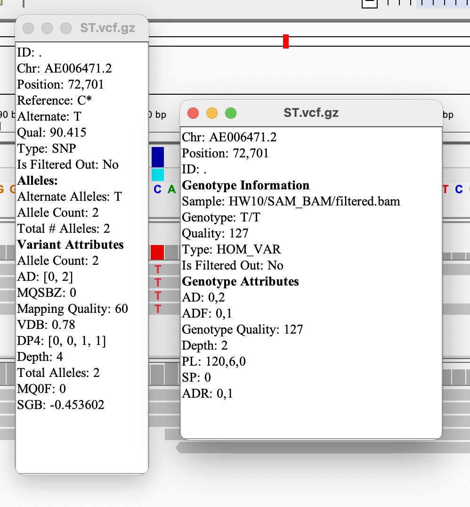
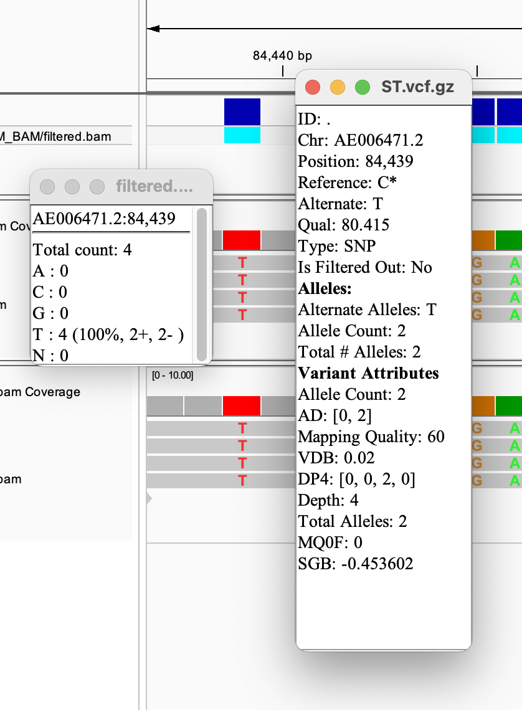
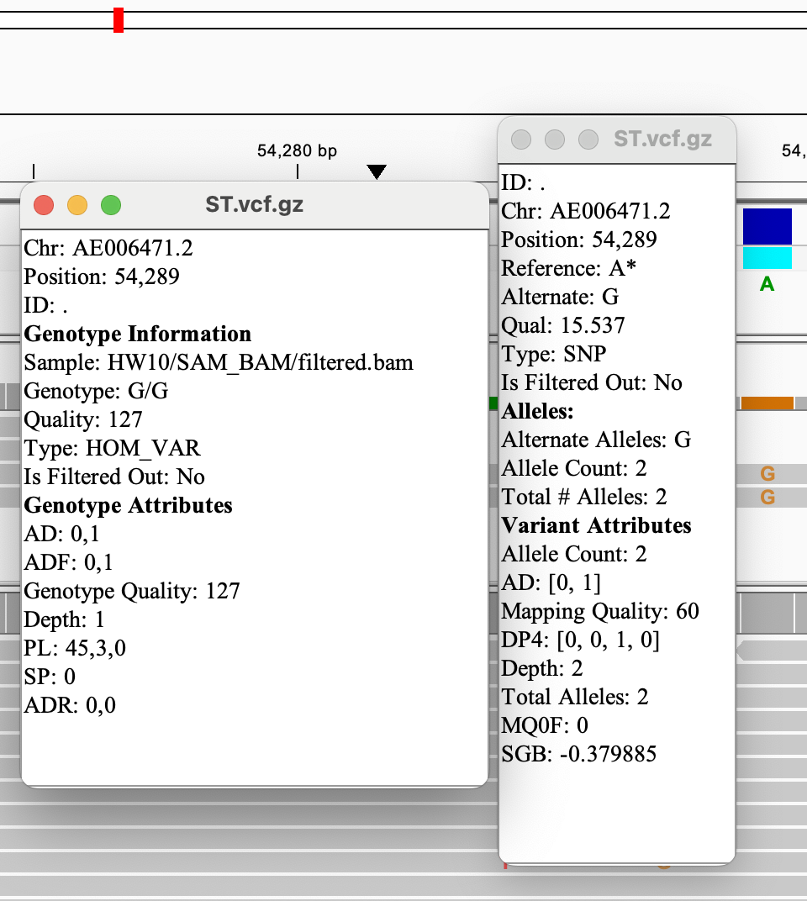
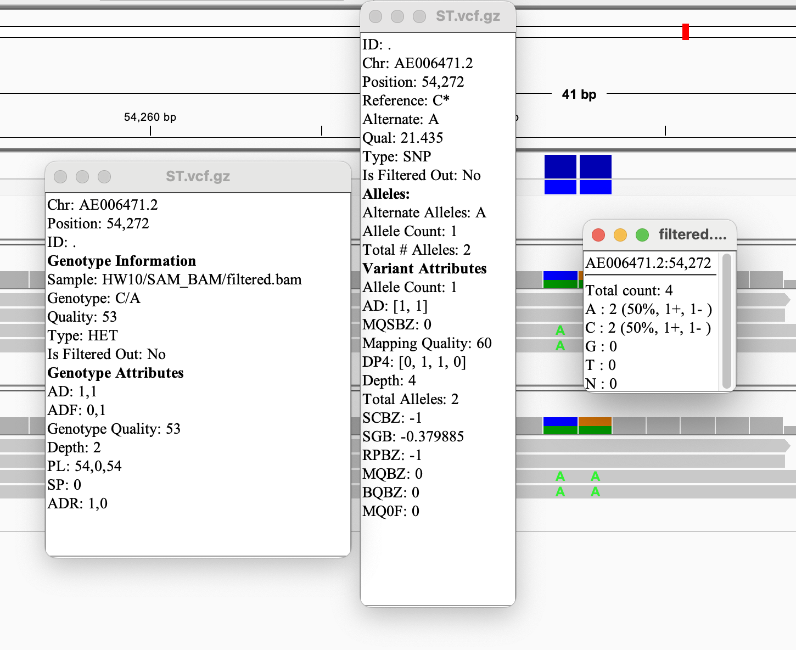
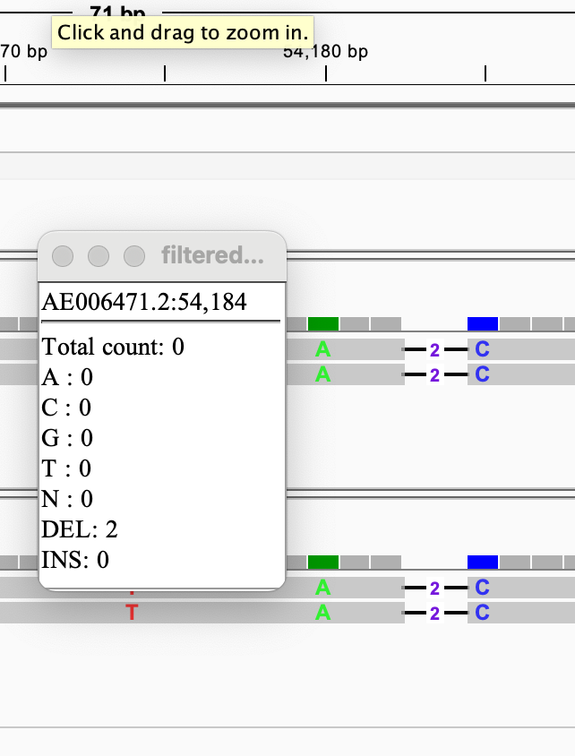
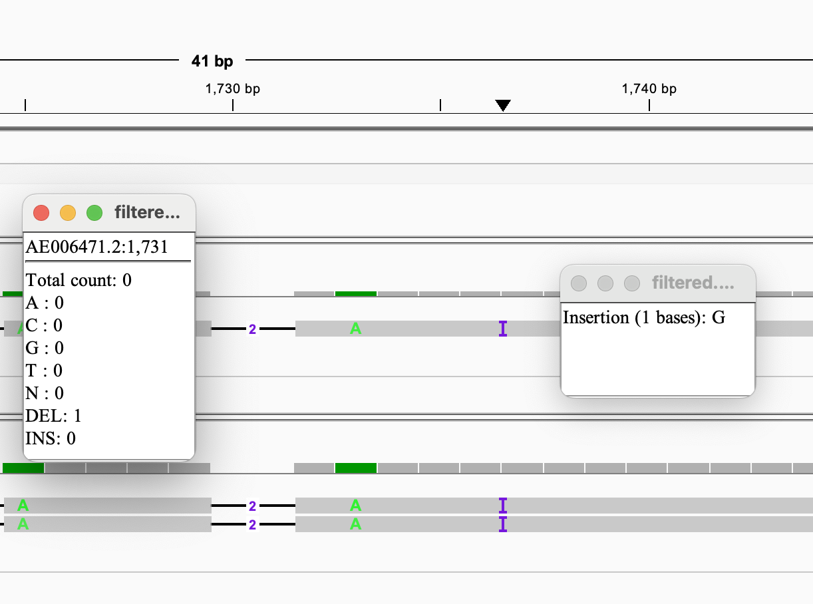

# Homework 10: Generate a variant call file
*Samantha Seibel November 10th, 2024*

*Using code from HW 9*

## Background

**Reference**

Salmonella Typhimurium (ST) LT2

NCBI RefSeq assembly: GCF_000006945.2

Submitted GenBank assembly: GCA_000006945.2

Taxon: Salmonella enterica subsp. enterica serovar Typhimurium str. LT2

Strain: LT2

Submitter: Washington University Genome Sequencing Center

Date: Jan 13, 2016

## Prior to Makefile

**Code before initiating Makefile**

```bash
#activate bioinfo environment

micromamba activate environment
```

## Constructing a Makefile using the following

*Targets*

**usage**: defines each target for user

**genome**: downloads assembly of selected organism

**simulate**: generates simulated fastq reads from the assembly

**download**: downloads subset of fastq files from select reads from NCBI SRA database

**quality**: runs fastqc on downloaded files

**trim**: trims fastq files with fastp based of output of fastqc then reruns fastqc

**index**: uses BWA to make an index from the ST LT2 reference

**align**: using samtools, create an alignment of both ST and simulated reads against reference, convert to a sorted, indexed BAM file, run stats

**evaluate**: using samtools to evaluate our generated BAM files

**filter**: filter BAM files to only contain properly paired primary alignments with a mapping quality of over 10

**vcf** create the variant call file

**all**: runs all of the above targets


## Identifying Variants

Generated a variant call file utilizing tools from the Bioinformatics Toolbox

Command to call the tool box:
```
bio code
```

This installs a directory called src which contains makefiles necessary to run specific pipelines like VCF.

From there I was able to visualize some of the variants produced from both the previously simulated. 

I found SNP variations:

I was a bit more convinced by the following SNPs as potentially being deviations from the reference rather than sequencing error





*Both of these had all four variants be different from the reference which increased my confidence in this position being a SNP in my sample*

However, in position 54,289, there were only two variants called, making me less confident and more wondering if this SNP was a false positive



*However, in position 54,272, there were only two of four variants called a SNP (A) from the original reference of C, decreasing my confidence in SNP calling*



I also located some indels within my variants:




*My confidence in this being a real variant is lower especially for the indel that only occurred in one variant*

## To increase confidence

- I should create other BAM files of *Salmonella* Typhimurium and compare to this reference to increase my understanding of how accurate this reference is to the isolate sequences.
- There is not much coverage from the initial alignment (not a significant amount of similarity between the data I downloaded and the reference. This analysis could benefit from an accession that's more recent (which could mean higher quality and depth)


