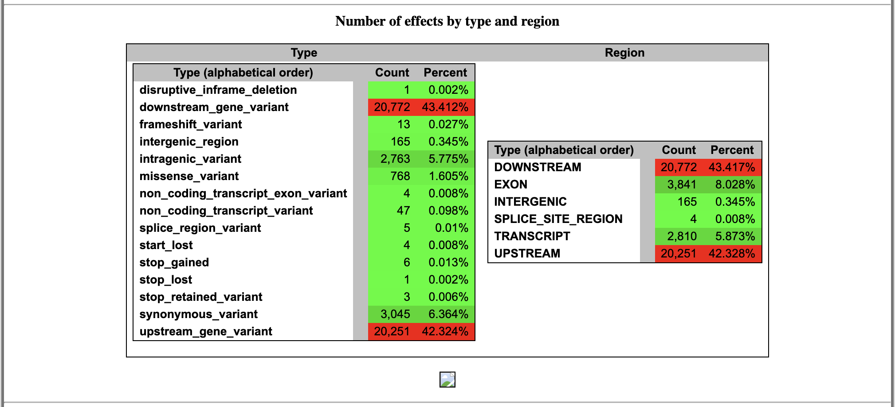

# Homework 11: Generate a variant call file
*Samantha Seibel November 17th, 2024*

*Using code from HW 10*

## Background

**Reference**

Salmonella Typhimurium (ST) LT2

NCBI RefSeq assembly: GCF_000006945.2

Submitted GenBank assembly: GCA_000006945.2

Taxon: Salmonella enterica subsp. enterica serovar Typhimurium str. LT2

Strain: LT2

Submitter: Washington University Genome Sequencing Center

Date: Jan 13, 2016

## Prior to Makefile

**Code before initiating Makefile**

```bash
#activate bioinfo environment

micromamba activate environment
```

## Constructing a Makefile using the following

*Targets*

**usage**: defines each target for user

**genome**: downloads assembly of selected organism

**simulate**: generates simulated fastq reads from the assembly

**download**: downloads subset of fastq files from select reads from NCBI SRA database

**quality**: runs fastqc on downloaded files

**trim**: trims fastq files with fastp based of output of fastqc then reruns fastqc

**index**: uses BWA to make an index from the ST LT2 reference

**align**: using samtools, create an alignment of both ST and simulated reads against reference, convert to a sorted, indexed BAM file, run stats

**evaluate**: using samtools to evaluate our generated BAM files

**filter**: filter BAM files to only contain properly paired primary alignments with a mapping quality of over 10

**vcf** create the variant call file

**snpEff** interpret variant effect

**all**: runs all of the above targets


## Identifying Variants

Command to use specifically for snpEff:
```
cd ~ # whatever home directory is
bio code # get the biostar handbook toolbox to run snpEff
chmod +x snpeff.mk # to make the make executable
```




