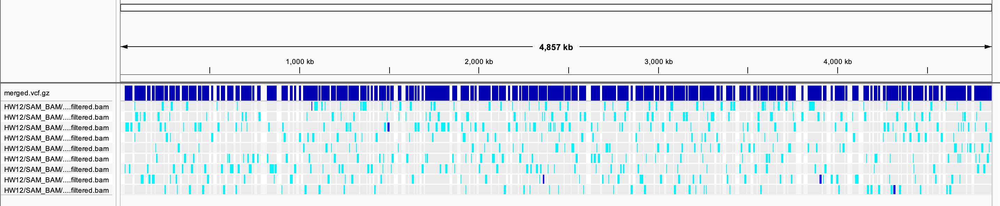
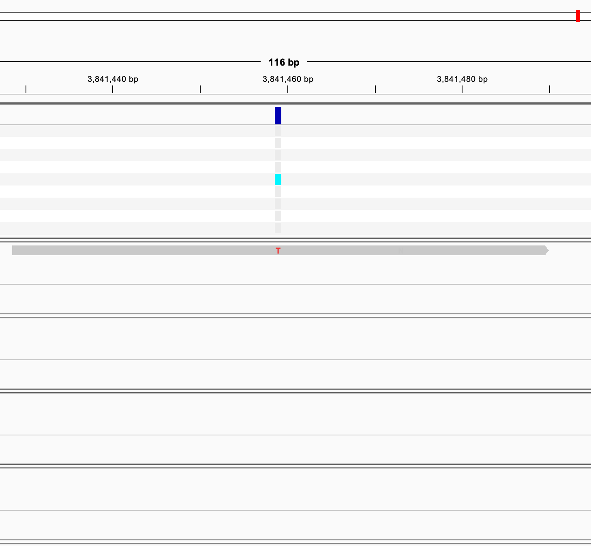

# Homework 12: Automate a VCF calling pipeline
*Samantha Seibel December 1st, 2024*

*Using code from HW 11*

## Background

**Reference**

Salmonella Typhimurium (ST) LT2

NCBI RefSeq assembly: GCF_000006945.2

Submitted GenBank assembly: GCA_000006945.2

Taxon: Salmonella enterica subsp. enterica serovar Typhimurium str. LT2

Strain: LT2

Submitter: Washington University Genome Sequencing Center

Date: Jan 13, 2016


**Downloaded Data**

*Salmonella enterica serovar Typhimurium genome sequencing of hns mutant evolved strains*

"H-NS belongs to a group of bacterial regulatory proteins known as xenogeneic silencers that repress the expression of horizontally acquired sequences with higher AT-content than the host genome. By dampening foreign gene expression, H-NS is thought to prevent the potentially harmful effects that unregulated, newly incorporated sequences may impart. In this study we performed experimental evolution to select for mutations that compensate for the strong fitness defects of S. Typhimurium hns mutants. 6 wild type and 6 independent S. Typhimrium hns mutant lineages were serially passaged for 300 generations. To identify the adaptive changes that ensued we applied Illumina whole genome sequencing."

BioProject: PRJNA213246
Registration date: 24-Jul-2013
University of Toronto


List of SRRs:
- SRR29260553
- SRR29260554
- SRR29260555
- SRR29260556
- SRR29260557
- SRR29260558
- SRR29260559
- SRR29260560
- SRR29260561
- SRR29260562

## Prior to Makefile

**Code before initiating Makefile**

```bash
#activate bioinfo environment

micromamba activate environment
```
**Make sure to run genome, design, and dry run before running parallel**
**Merge target needs to be run after parallel has finished!**

## Constructing a Makefile using the following

*Targets*

**usage**: defines each target for user

**genome**: downloads assembly of selected organism

**download**: downloads subset of fastq files from select reads from NCBI SRA database

**quality**: runs fastqc on downloaded files

**trim**: trims fastq files with fastp based of output of fastqc then reruns fastqc

**index**: uses BWA to make an index from the ST LT2 reference

**align**: using samtools, create an alignment of ST reads against reference, convert to a sorted, indexed BAM file, run stats

**filter**: filter BAM files to only contain properly paired primary alignments with a mapping quality of over 10

**vcf** create the variant call file

**all**: runs all of the above targets

**design**: creates a csv with all the important metadata for each SRR from a chosen BioProject ID

**dry-run**: runs a dry run on the parallel command

**parallel**: runs each SRR through the full pipeline in unison


## Using GNU Parallel to create multiple VCFs

There appear to be a significant amount of variants (SNPs) between the different samples and the reference. There is not a lot of coverage from the samples on the LT2 reference implying to me that LT2 may not be the best reference for this. Interestingly as well, there is not a lot of concordance between the samples either. There does not appear to be two distinct groups like implied in the BioProject's abstract, which you'd expect if these were from the same strain, but the reference may be confusing that.





