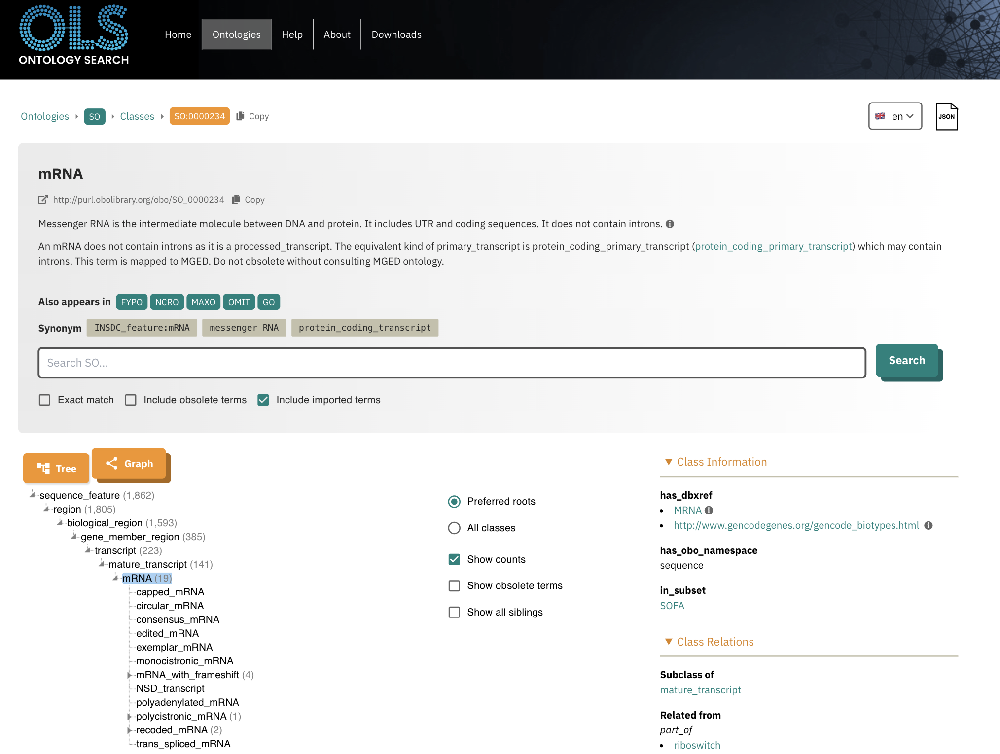

# Homework 4: Scripting and Sequence Ontologies
*Samantha Seibel September 22nd, 2024*

**Examining Features in Sequence Ontology**
## Choose a feature type from the GFF file and look up its definition in the sequence ontology
Selected feature: mRNA
## Find both the parent terms and children nodes of the term

## Provide a short discussion of what you found
The definition provided by the Sequence Ontology program defines mRNA as "Messenger RNA is the intermediate molecule between DNA and protein. It includes UTR and coding sequences. It does not contain introns."

I thought this was interesting that it implies that the mRNA is post-splicing out the introns which is not what I would immediately jump to if I heard the term mRNA. However when you look into the parent directory, it defines mRNA as a part of "mature_transcripts" which clarifies the lack of introns. When looking at the child nodes of mRNA, there are 19 terms like "capped_mRNA" and "recoded_mRNA". When I went further into the recoded_mRNA, I found its definition was "The sequence of a mature mRNA transcript, modified before translation or during translation, usually by special cis-acting signals." which I hadn't heard of cis-acting regular motif mRNA elements before. I found out that edits to these cis and trans elements have been implicated in diseases like leukemia.
