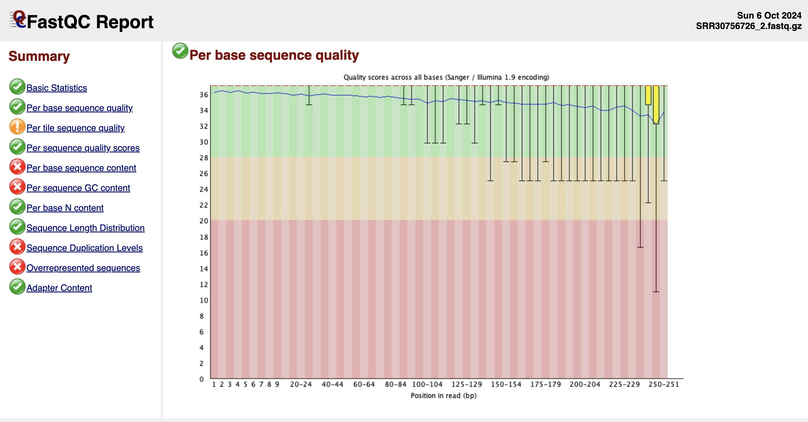

# Homework 6: FASTQ Quality Control
*Samantha Seibel October 6th, 2024*

**Select SRA project of interest, then download the corresponding FASTQ files**
Selected: 16S of mouse gut mircobiome: Male 

NCBI Taxonomy ID: SRR30756726

Bioproject: PRJNA1158932

Description: Phage therapy targeted E.coli Raw 16S sequence reads

**From the FASTQC analysis of the dataset**

There is a need to clean the data

**Using the tool fastp to clean the data**

https://github.com/OpenGene/fastp
Shifu Chen, Yanqing Zhou, Yaru Chen, Jia Gu, fastp: an ultra-fast all-in-one FASTQ preprocessor, Bioinformatics, Volume 34, Issue 17, September 2018, Pages i884–i890, https://doi.org/10.1093/bioinformatics/bty560

I used the sliding window and increase the phred score threshold from 15 to 20

Using fastp we have removed: 
-3% of reads due to low quality (5.7K reads)
-6 reads with too many ambiguous bases

**Comparison

