# Homework 7: Writing a Makefile
*Samantha Seibel October 13th, 2024*

*Using code from HWs 5 and 6*

*I incorporated my plots because I used different data than in Homework 5 and 6*

## Background

**Bacteria of Interest**

Salmonella Typhimurium LT2

NCBI RefSeq assembly: GCF_000006945.2

Submitted GenBank assembly: GCA_000006945.2

Taxon: Salmonella enterica subsp. enterica serovar Typhimurium str. LT2

Strain: LT2

Submitter: Washington University Genome Sequencing Center

Date: Jan 13, 2016

**Sequencing Run of Interest**

Salmonella enterica serovar Typhimurium genome sequencing

BioSample: SAMN03470052

Submitter: Ruiting Lan from University of New South Wales

Date: April 9th, 2015

## Prior to Makefile

**Code before initiating Makefile**

#activate bioinfo environment

micromamba activate environment

**Constructing a Makefile using the following**

*Targets*

usage: defines each target for user

genome: downloads assembly of selected organism

simulate: generates simulated fastq reads from the assembly

download: downloads subset of fastq files from select reads from NCBI SRA database

quality: runs fastqc on downloaded files

trim: trims fastq files with fastp based of output of fastqc then reruns fastqc

## Running the Makefile

*usage*
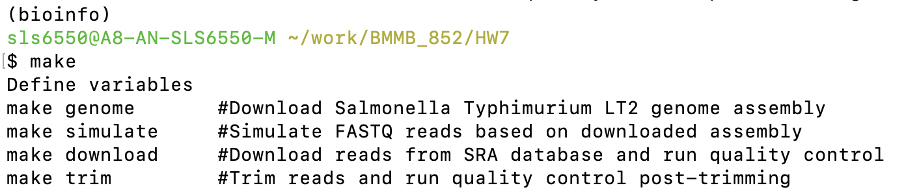

*genome*

#I had issues with the efetch command I couldn't resolve

#I manually downloaded the fasta file and will proceed with this

#may be due to outage in the NCBI? Also not sure if -db assembly or genome is correct

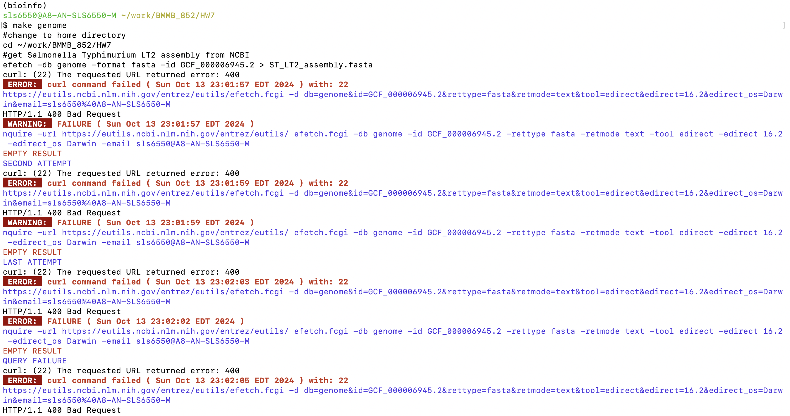

*simulate*
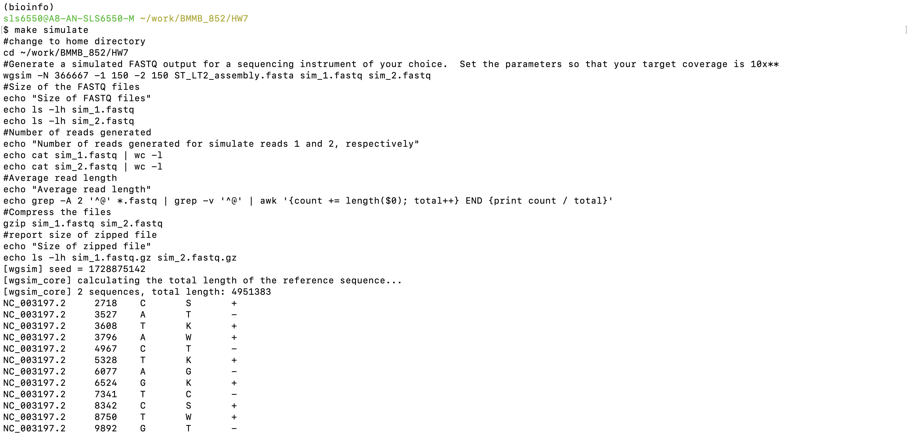
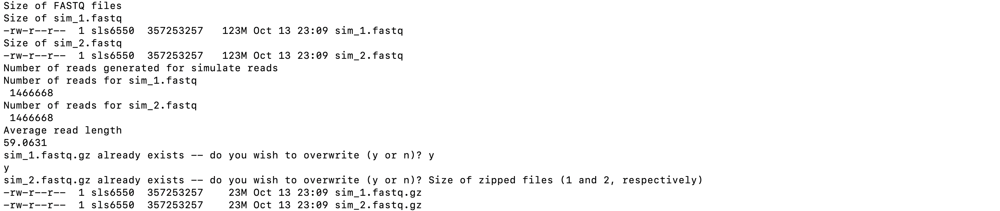

*download*

*quality*
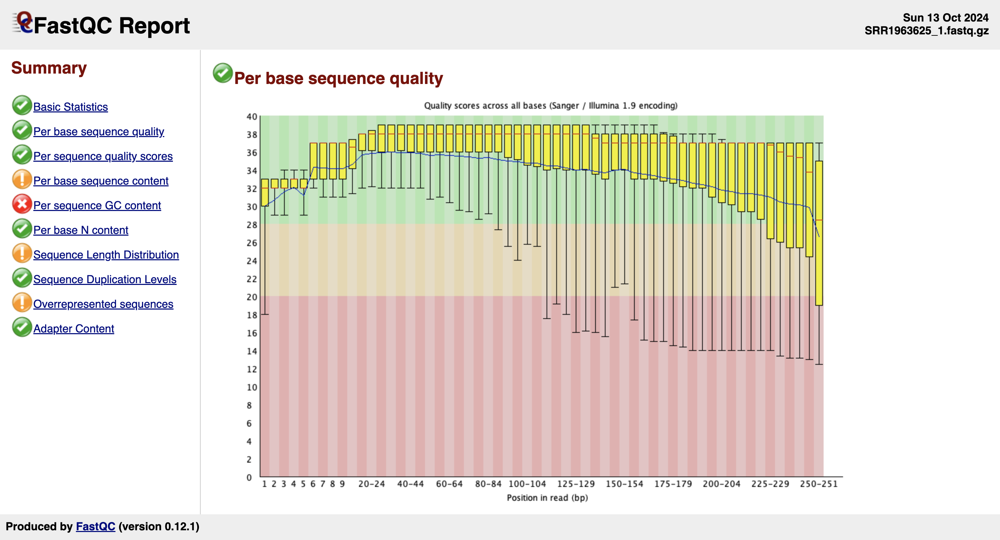
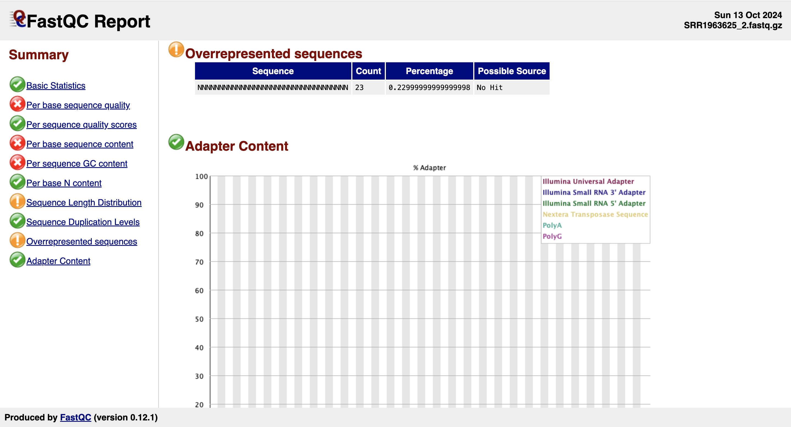
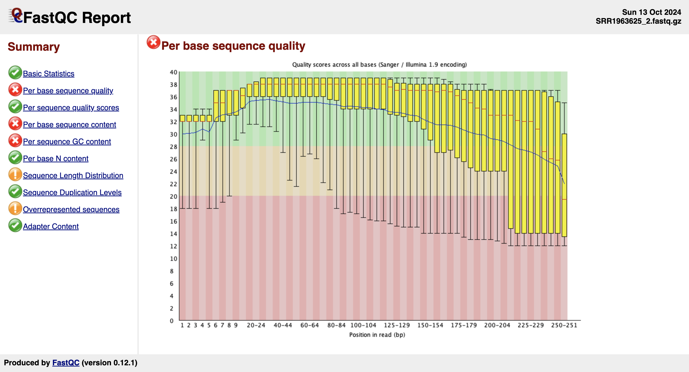
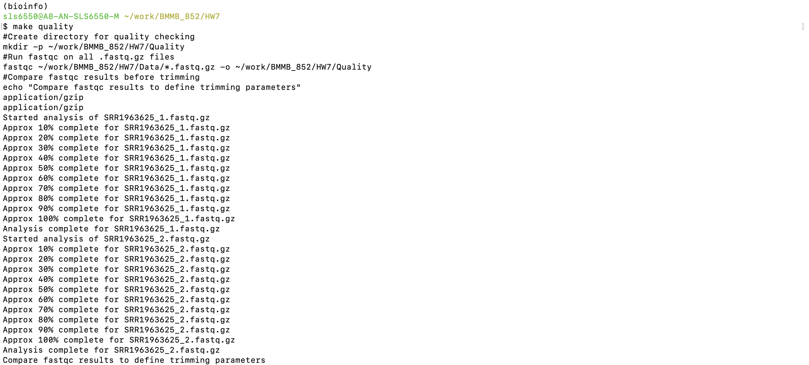

*trim*
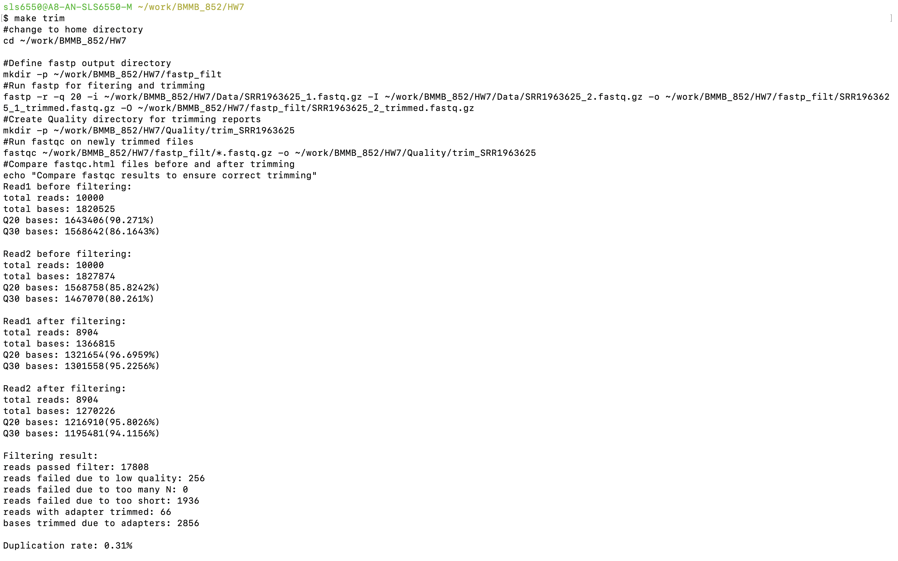
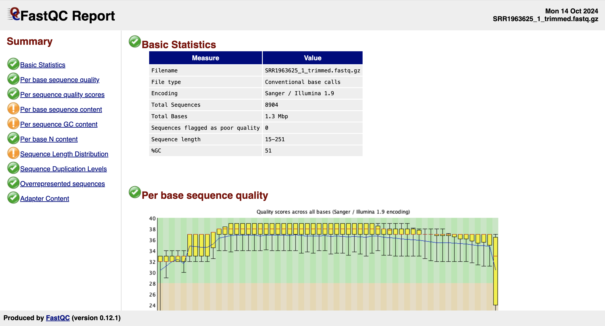
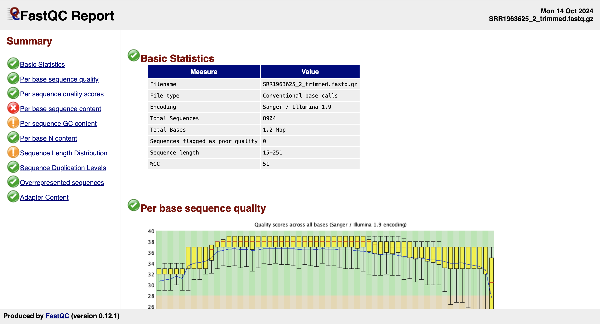

