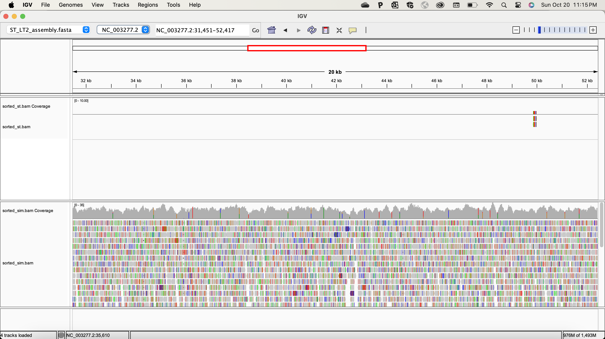
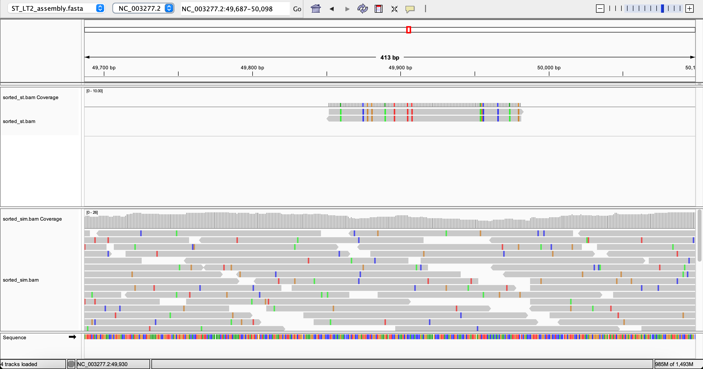

# Homework 8: Making a BAM file
*Samantha Seibel October 20th, 2024*

*Using code from HWs 7*

## Background

**Reference**

Salmonella Typhimurium (ST) LT2

NCBI RefSeq assembly: GCF_000006945.2

Submitted GenBank assembly: GCA_000006945.2

Taxon: Salmonella enterica subsp. enterica serovar Typhimurium str. LT2

Strain: LT2

Submitter: Washington University Genome Sequencing Center

Date: Jan 13, 2016

## Prior to Makefile

**Code before initiating Makefile**

```bash
#activate bioinfo environment

micromamba activate environment
```

## Constructing a Makefile using the following

*Targets*

**usage**: defines each target for user

**genome**: downloads assembly of selected organism

**simulate**: generates simulated fastq reads from the assembly

**download**: downloads subset of fastq files from select reads from NCBI SRA database

**quality**: runs fastqc on downloaded files

**trim**: trims fastq files with fastp based of output of fastqc then reruns fastqc

**index**: uses BWA to make an index from the ST LT2 reference

**align**: using samtools, create an alignment of both ST and simulated reads against reference, convert to a sorted, indexed BAM file, run stats

**all**: runs all of the above targets


## Visualize in IGV

Clear overlap from the simulated reads, but very limited ones from the ST from SRA


The only visual overlap from the LT2 reference



## Samtools Stats

All reads aligned for the simulated reads, but only 15403/17808 map of the ST from SRA

I was confused why there wasn't more overlap between the ST reads from SRA and the LT2 reference as NCBI Genomes starred this as their reference

